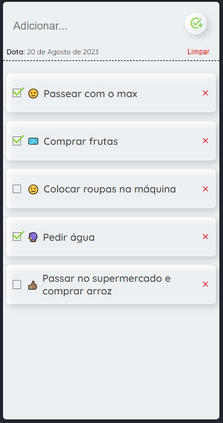
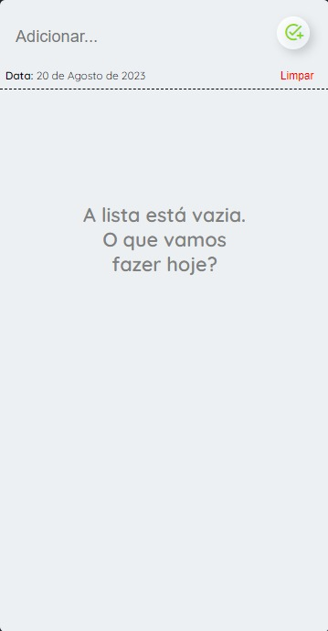
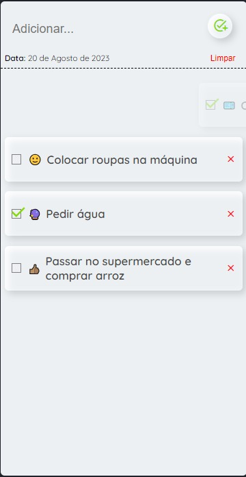

# My to do List

### Descrição:
Comecei a estudar React e com o passar do tempo, percebi que conseguiria fazer certos projetos sozinhos. Então resolvi começar com um projeto simples, To do List. 🤠

<small style="color: gray">_edited_: projeto de agosto/2023.</small>

### Sobre:
A "aplicação" em si é bem simples. Você digita a tarefa na qual quer guardar e ela aparece na lista, bem simples não? Uma coisa que me desafiei em fazer foi salvar todas as *tasks* no localStorage. Assim todas as tarefas ficariam salvas mesmo após um F5, um refresh, ou uma atualização de página da vida. Coloquei alguns emojis pra deixar a interface um pouco mais colorida e amigável e adicionei uma animação de snap quando a tarefa é removida.

| Interface | Sem tarefas | Snap animation |
|-------|-------------|------|
||||

### Comentário: 
Com um tempo programando percebi que com React tive que pensar de outra maneira. As coisas no React parecem ser simples, porém complicado de pegar ainda em uma segunda vez. Um exemplo é que no React tem um tal de Estado, um hook que muda estado de váriaveis do tipo *__const__*. Outra coisa também é que aqui não tem querySelector, até tem, porém eu enfrentei problemas em usa-lo, então aqui você tem que pensar de forma diferente. Um jeito novo de se programar. Embora um pouco desafiador, com o tempo, programar em React se torna até mais rápido. Com o tempo o certo, vou evoluir ainda mais nessa biblioteca. Muito obrigado por ter lido até aqui, fico lisonjeado pelo seu tempo. <3

#
Resultado final: https://my-to-do-list-one-khaki.vercel.app/
